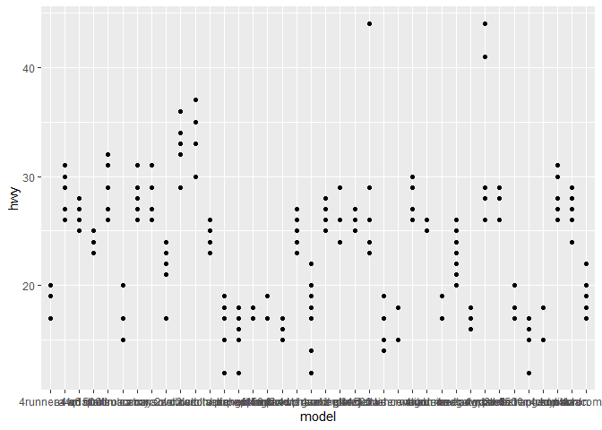

Homework 3
================
John
9/3/2021

``` r
library(tidyverse)
```

    ## Warning: package 'tidyverse' was built under R version 4.1.1

    ## -- Attaching packages --------------------------------------- tidyverse 1.3.1 --

    ## v ggplot2 3.3.5     v purrr   0.3.4
    ## v tibble  3.1.3     v dplyr   1.0.7
    ## v tidyr   1.1.3     v stringr 1.4.0
    ## v readr   2.0.0     v forcats 0.5.1

    ## -- Conflicts ------------------------------------------ tidyverse_conflicts() --
    ## x dplyr::filter() masks stats::filter()
    ## x dplyr::lag()    masks stats::lag()

``` r
#mpg is a package under tidyverse
```

# Intro:

I am curious about model vs highway milage loading tidyverse and mpg

``` r
library(tidyverse)
```

viewing mpg data

``` r
head(mpg)
```

    ## # A tibble: 6 x 11
    ##   manufacturer model displ  year   cyl trans      drv     cty   hwy fl    class 
    ##   <chr>        <chr> <dbl> <int> <int> <chr>      <chr> <int> <int> <chr> <chr> 
    ## 1 audi         a4      1.8  1999     4 auto(l5)   f        18    29 p     compa~
    ## 2 audi         a4      1.8  1999     4 manual(m5) f        21    29 p     compa~
    ## 3 audi         a4      2    2008     4 manual(m6) f        20    31 p     compa~
    ## 4 audi         a4      2    2008     4 auto(av)   f        21    30 p     compa~
    ## 5 audi         a4      2.8  1999     6 auto(l5)   f        16    26 p     compa~
    ## 6 audi         a4      2.8  1999     6 manual(m5) f        18    26 p     compa~

# creating plot displaying “model vs highway milage”

``` r
print(mpg)
```

    ## # A tibble: 234 x 11
    ##    manufacturer model      displ  year   cyl trans drv     cty   hwy fl    class
    ##    <chr>        <chr>      <dbl> <int> <int> <chr> <chr> <int> <int> <chr> <chr>
    ##  1 audi         a4           1.8  1999     4 auto~ f        18    29 p     comp~
    ##  2 audi         a4           1.8  1999     4 manu~ f        21    29 p     comp~
    ##  3 audi         a4           2    2008     4 manu~ f        20    31 p     comp~
    ##  4 audi         a4           2    2008     4 auto~ f        21    30 p     comp~
    ##  5 audi         a4           2.8  1999     6 auto~ f        16    26 p     comp~
    ##  6 audi         a4           2.8  1999     6 manu~ f        18    26 p     comp~
    ##  7 audi         a4           3.1  2008     6 auto~ f        18    27 p     comp~
    ##  8 audi         a4 quattro   1.8  1999     4 manu~ 4        18    26 p     comp~
    ##  9 audi         a4 quattro   1.8  1999     4 auto~ 4        16    25 p     comp~
    ## 10 audi         a4 quattro   2    2008     4 manu~ 4        20    28 p     comp~
    ## # ... with 224 more rows

``` r
ggplot(data = mpg) + geom_point(mapping = aes(x = model, y = hwy))
```

<!-- -->

important note: x axis is a bit clustered… Will need to learn how to
edit this problem. I was trying to view which model had the best highway
mileage, and view trends to see if a particular maker had the best
highway mileage
