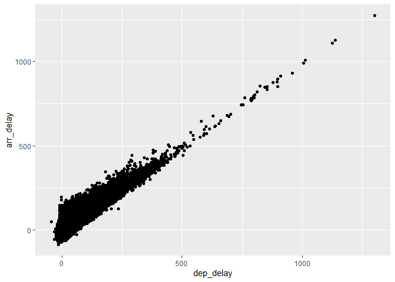

functions
================

Assigning “2” to “a” and “3” to “b”, printing the sum of “a + b”

``` r
a <- 2
b <- 3
print (a+b)
```

    ## [1] 5

``` r
sum(2+3)
```

    ## [1] 5

Creating graph displaying arrival delay vs departure delay

``` r
library(tidyverse)
```

    ## Warning: package 'tidyverse' was built under R version 4.1.1

    ## -- Attaching packages --------------------------------------- tidyverse 1.3.1 --

    ## v ggplot2 3.3.5     v purrr   0.3.4
    ## v tibble  3.1.3     v dplyr   1.0.7
    ## v tidyr   1.1.3     v stringr 1.4.0
    ## v readr   2.0.0     v forcats 0.5.1

    ## -- Conflicts ------------------------------------------ tidyverse_conflicts() --
    ## x dplyr::filter() masks stats::filter()
    ## x dplyr::lag()    masks stats::lag()

``` r
library(nycflights13)
```

    ## Warning: package 'nycflights13' was built under R version 4.1.1

``` r
data("flights")
AA_flights = filter(flights, carrier == "AA")
ggplot(data = flights) + geom_point(mapping = aes(x=dep_delay, y=arr_delay))
```

    ## Warning: Removed 9430 rows containing missing values (geom_point).

<!-- -->
