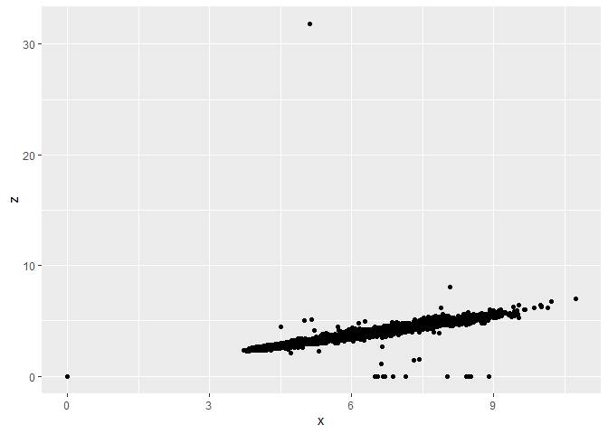
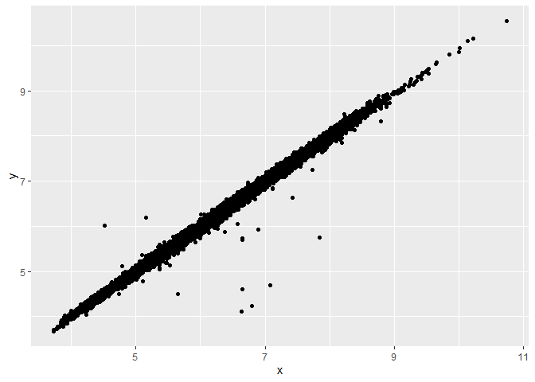
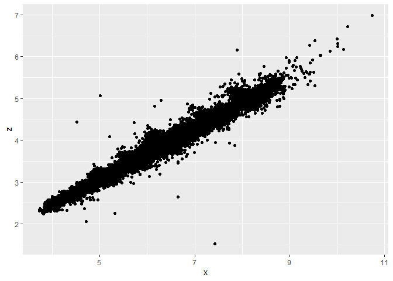

HW5.2
================
John
11/23/2021

``` r
library(tidyverse)
```

    ## Warning: package 'tidyverse' was built under R version 4.1.1

    ## -- Attaching packages --------------------------------------- tidyverse 1.3.1 --

    ## v ggplot2 3.3.5     v purrr   0.3.4
    ## v tibble  3.1.3     v dplyr   1.0.7
    ## v tidyr   1.1.3     v stringr 1.4.0
    ## v readr   2.0.0     v forcats 0.5.1

    ## -- Conflicts ------------------------------------------ tidyverse_conflicts() --
    ## x dplyr::filter() masks stats::filter()
    ## x dplyr::lag()    masks stats::lag()

``` r
glimpse(diamonds)
```

    ## Rows: 53,940
    ## Columns: 10
    ## $ carat   <dbl> 0.23, 0.21, 0.23, 0.29, 0.31, 0.24, 0.24, 0.26, 0.22, 0.23, 0.~
    ## $ cut     <ord> Ideal, Premium, Good, Premium, Good, Very Good, Very Good, Ver~
    ## $ color   <ord> E, E, E, I, J, J, I, H, E, H, J, J, F, J, E, E, I, J, J, J, I,~
    ## $ clarity <ord> SI2, SI1, VS1, VS2, SI2, VVS2, VVS1, SI1, VS2, VS1, SI1, VS1, ~
    ## $ depth   <dbl> 61.5, 59.8, 56.9, 62.4, 63.3, 62.8, 62.3, 61.9, 65.1, 59.4, 64~
    ## $ table   <dbl> 55, 61, 65, 58, 58, 57, 57, 55, 61, 61, 55, 56, 61, 54, 62, 58~
    ## $ price   <int> 326, 326, 327, 334, 335, 336, 336, 337, 337, 338, 339, 340, 34~
    ## $ x       <dbl> 3.95, 3.89, 4.05, 4.20, 4.34, 3.94, 3.95, 4.07, 3.87, 4.00, 4.~
    ## $ y       <dbl> 3.98, 3.84, 4.07, 4.23, 4.35, 3.96, 3.98, 4.11, 3.78, 4.05, 4.~
    ## $ z       <dbl> 2.43, 2.31, 2.31, 2.63, 2.75, 2.48, 2.47, 2.53, 2.49, 2.39, 2.~

``` r
sample_frac(diamonds, 0.01, replace = TRUE)
```

    ## # A tibble: 539 x 10
    ##    carat cut       color clarity depth table price     x     y     z
    ##    <dbl> <ord>     <ord> <ord>   <dbl> <dbl> <int> <dbl> <dbl> <dbl>
    ##  1  0.52 Premium   G     SI2      59.2    60  1121  5.29  5.21  3.11
    ##  2  1.13 Fair      I     VS2      55.9    67  4695  7.05  6.94  3.9 
    ##  3  0.35 Premium   E     SI2      61      58   630  4.56  4.52  2.77
    ##  4  1    Fair      E     SI1      65.8    59  4798  6.07  6.15  4.02
    ##  5  0.7  Good      F     SI2      61.6    61  2109  5.66  5.68  3.49
    ##  6  1.11 Premium   G     SI1      60.9    59  4096  6.69  6.64  4.07
    ##  7  1.1  Very Good E     SI2      60.9    60  4539  6.61  6.66  4.04
    ##  8  1.52 Premium   D     SI1      59.2    61 12823  7.59  7.55  4.48
    ##  9  0.31 Premium   G     VS2      59.2    60   544  4.42  4.47  2.63
    ## 10  1.6  Premium   F     SI2      61.8    57  6899  7.51  7.46  4.63
    ## # ... with 529 more rows

``` r
group_by(diamonds, clarity)
```

    ## # A tibble: 53,940 x 10
    ## # Groups:   clarity [8]
    ##    carat cut       color clarity depth table price     x     y     z
    ##    <dbl> <ord>     <ord> <ord>   <dbl> <dbl> <int> <dbl> <dbl> <dbl>
    ##  1  0.23 Ideal     E     SI2      61.5    55   326  3.95  3.98  2.43
    ##  2  0.21 Premium   E     SI1      59.8    61   326  3.89  3.84  2.31
    ##  3  0.23 Good      E     VS1      56.9    65   327  4.05  4.07  2.31
    ##  4  0.29 Premium   I     VS2      62.4    58   334  4.2   4.23  2.63
    ##  5  0.31 Good      J     SI2      63.3    58   335  4.34  4.35  2.75
    ##  6  0.24 Very Good J     VVS2     62.8    57   336  3.94  3.96  2.48
    ##  7  0.24 Very Good I     VVS1     62.3    57   336  3.95  3.98  2.47
    ##  8  0.26 Very Good H     SI1      61.9    55   337  4.07  4.11  2.53
    ##  9  0.22 Fair      E     VS2      65.1    61   337  3.87  3.78  2.49
    ## 10  0.23 Very Good H     VS1      59.4    61   338  4     4.05  2.39
    ## # ... with 53,930 more rows

``` r
top_100 <- diamonds %>%
  group_by(clarity) %>%
  slice_max(carat, n=100) %>%
  summarise(mean(carat), na.rm = TRUE)
```

Plot Y vs X

``` r
ggplot(data = diamonds, aes(x = x, y = y)) + geom_point()
```

<!-- -->

Plot Z vs X

``` r
ggplot(data = diamonds, aes(x = x, y = z)) + geom_point()
```

<!-- --> Refined Y
vs X graph

``` r
diamonds2 <- diamonds %>%
  filter(x >= 3 & x <= 11 & y >= 3 & y <= 11 & z <= 10)
ggplot(data = diamonds2, aes(x = x, y = y)) + geom_point()
```

<!-- --> Refined Z
vs X graph

``` r
diamonds2 <- diamonds %>%
  filter(x >= 3 & x <= 11 & y >= 3 & y <= 11 & z >= 1.5 & z <= 10)
ggplot(data = diamonds2, aes(x = x, y = z)) + geom_point()
```

<!-- -->
