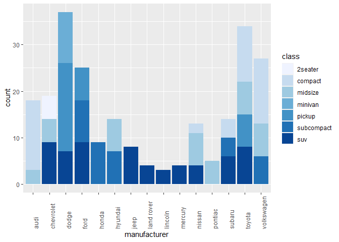
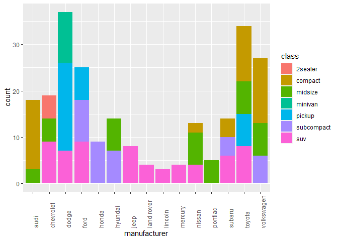

HW\_7
================
John
10/3/2021

``` r
library(ggplot2)
library(ggthemes)
library(scales)
library(dplyr)
```

The plot below is the bad plot. The issue I have with this stacked bar
chart is that it uses a sequential white to blue scale when the
categories that are on display do not need to be displayed in an ordered
fashion based off of a sequential color scale (Healy, Data
visualization, a practical introduction). As a result, it is pretty
challenging to determine categories that are represented by similar
shades of blue (ex: minivan vs pickup, pickup vs subcompact), making the
chart somewhat useless. Tufte chapter 5 suggests that including visual
patterns within each bar is just as ineffective, claiming that this
strategy is often viewed as a distraction. When data does not need to be
displayed in an ordered fashion, Healy suggests that it is best to
display the data in unordered hues.

``` r
pl <- ggplot(data = mpg,aes(x= manufacturer, fill = class))
pl <- pl + geom_bar(stat="count")
pl <- pl  + theme(axis.text.x = element_text(angle = 90,hjust =0 )) + scale_fill_brewer()
pl
```

<!-- -->

``` r
pl <- ggplot(data = mpg,aes(x= manufacturer, fill = class))
pl <- pl + geom_bar(stat="count")
pl <- pl  + theme(axis.text.x = element_text(angle = 90,hjust =0 ))
pl
```

<!-- -->

**It should be noted that I used the above example from
[this](https://youtu.be/RPwJ6ExwPbg) R training video, and used a
[predefined color
pallet](https://r-charts.com/part-whole/stacked-bar-chart-ggplot2/) from
r-charts.com.**
